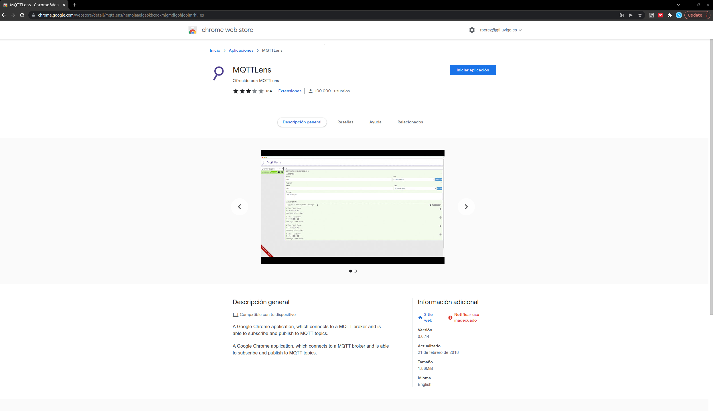
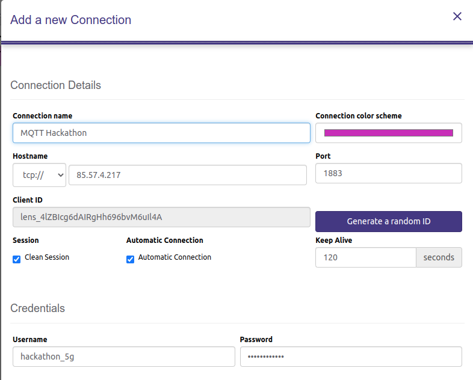

Hackathon 5G
========

 * [Reto](#1-reto)
 * [Arquitectura](#2-arquitectura)
 * [Cómo empezar](#3-como-empezar)
 * [Cómo lanzar la aplicación base ](#4-como-lanzar-la-aplicacin-base)
 * [Cómo desarrollar la parte de reconocimiento de texto](#5-como-desarrollar-la-parte-de-reconocimiento-de-texto)
 * [Cómo entregar el código](#6-como-entregar-el-cdigo)
 * [Pistas para reconocer texto (OCR)](#7-pistas-para-reconocer-texto-ocr)
 * [Curiosidades](#8-curiosidades)

### 1. Reto

El reto consiste en completar un circuito de conducción mediante el control remoto de un coche a través de la red 5G de 
Orange.

No dispondréis de visión directa del coche, por lo que la conducción se basará en las imágenes de vídeo capturadas y 
retransmitidas por el propio vehículo en tiempo real a través de la red 5G.

A lo largo del circuito existirán diversos puntos de verificación sobre los que habrá que detectar y reconocer, mediante 
visión artificial, el texto de un conjunto específico de imágenes. Si se realizan correctamente dichas verificaciones, 
se conseguirán bonificaciones que se sumarán al marcador final de la competición.

Este repositorio contiene el código base para detectar los puntos de verificación, es decir, los carteles que estarán 
colocados antes de entrar al terreno de juego. 

Vuestra tarea será añadir a este código la parte de reconocimiento de texto, para que en lugar de que se muestre "TEXT 
SAMPLE" se muestre el texto del cartel detectado.

### 2. Arquitectura
<center>
  
</center>

Para poder controlar el coche en remoto, hemos instalado a bordo una raspberry pi 4, una navio2, un dongle 5G y una 
webcam Logitech C920. La raspberry pi 4 
será el ordenador de abordo del coche y se encargará de la gestión del resto de componentes. La navio2, 
colocada sobre la raspberry pi 4, servirá para poder controlar el motor y el giro del coche. La webcam Logitech C920 
servirá como cámara de a bordo del coche. Y, el dongle 5G permitirá conectar el coche a la red 5G.

El coche realiza dos tareas, por un lado, envía el vídeo capturado de la cámara Logitech C920 a través de
la red 5G a dos ubicaciones distintas, marcadas en el diagrama como "STREAMING 1" y "STREAMING 2", además, envía la 
telemetría al PC + Monitor donde se va a visualizar el vídeo del coche. 

El PC + Monitor, que está conectado a la red 5G a través de un CPE 5G de ZTE, le envía los comandos de movimiento al 
coche. Los comandos de movimiento están mapeados a 
un mando de XBOX.

El flujo de vídeo "STREAMING 1" se publica en un servidor RTSP que tenemos lanzado en el Edge de Orange. Por si tenéis 
curiosidad, el servidor RTSP que usamos en esta competición es el siguiente: 
[RTSP SIMPLE SERVER](https://github.com/aler9/rtsp-simple-server). 

Como no podemos tener el coche dando vueltas al circuito de forma infinita y vosotros necesitáis el streaming para poder 
desarollar vuestra solución, os hemos grabado un pequeño clip en bucle, que se encuentra disponible en esta URL: 

```shell
rtsp://193.146.210.228:8554/car
```

Para poder abrir esta URL, bien podéis ejecutar del reproductor VLC (Media -> Open Network Stream -> Please enter a network
url: rtsp://193.146.210.228:8554/car). 

También podéis usar el siguiente comando de ffplay (método recomendado).
```shell
ffplay -fflags nobuffer -rtsp_transport tcp  -an rtsp://193.146.210.228:8554/car
```

Para poder usar este comando, vais a tener que instalar FFMPEG.
```shell
sudo apt-get update
sudo apt install ffmpeg -y
```

El "STREAMING 2" es el flujo de vídeo que la raspberry pi 4 envía al PC + Monitor.

Las aplicaciones que desarrolléis en este Hackathon las vamos a lanzar en el edge de Orange. El edge es un 
paradigma que permite el despliegue de aplicaciones como entidades software que se pueden 
ejecutar sobre infraestructuras virtuales o bare metal y localizadas cerca del usuario final, ayudando a reducir la 
latencia entre el usuario y la ubicación de cómputo. En otras palabras, se trata de colocar equipos de cómputo dentro de la red del operador, lo más cercano al usuario
final, para reducir la latencia de las comunicaciones.

En el edge de Orange tendremos lanzadas dos aplicaciones base, un <strong>servidor RTSP</strong> y 
un <strong>broker MQTT</strong>.

### 3. Cómo empezar

<strong>Requisitos</strong>:
- Ubuntu 18.04 o 20.04 (o cualquier otra distro Linux)
- PC con CPU Intel (Es posbile que PCs con CPU AMD den problemas con el software de visón artificial que vamos a usar)
- Tener instalado Visual Studio Code: <https://code.visualstudio.com/download>

En este hackathon, además de desarrollar una solución de visión artificial, váis a aprender a usar un poco docker. Docker
es una plataforma de software que permite crear, probar e implementar aplicaciones rápidamente. Docker empaqueta 
software en unidades estandarizadas llamadas contenedores que incluyen todo lo necesario para que el software se 
ejecute, incluidas bibliotecas, herramientas de sistema, código y tiempo de ejecución. Con Docker, se puede implementar 
y ajustar la escala de aplicaciones rápidamente en cualquier entorno con la certeza de saber el código se ejecutará.

Docker es similar aunque muy distinto a tener vuestro software corriendo sobre una máquina virtual, ya que la ejecución 
del código también está aislada. Sin embargo, una vm virtualiza sobre vuestro equipo toda la parte hardware 
y debe tener instalado un sistema operativo, es decir, es un sistema operativo completo que funciona de manera aislada 
sobre otro sistema operativo completo. Sin embargo, docker aisla aplicaciones, no sistemas operativos completos, esto
quiere decir, que docker va a usar vuestro sistema operativo para ejecutar los contenedores, aunque los ejecuta de manera
aislada a vuestro pc.

Podéis aprender más sobre docker aquí: <https://docs.docker.com/get-started/>

Para la parte de visión artificial, vamos a usar OpenVINO, librería de Deep Learning, desarrollada por
Intel en C++ que permite el desarrollo de aplicaciones de visual analytics, procesado de lenguaje natural, reconocimiento
automático del habla y sistemas de recomendación. Además, OpenVINO está diseñado para maximizar el rendimiento
de dispositivos hardware propietarios de Intel, tales como CPUs, tarjetas gráficas integradas o aceleradoras Intel
Movidius VPUs Myriad X.

La librería OpenVINO incluye los siguientes componentes:
- Deep Learning Model Optimizer.
- Deep Learning Inference Engine.
- Deep Learning Workbench.
- Inference Engine Samples.
- Open Model Zoo.
- Deep Learning Streamer.
- OpenCV.

Podéis aprender más sobre OpenVINO aquí: <https://docs.openvino.ai/latest/index.html>

En este hackathon, para la parte de detección de carteles, usamos el modelo horizontal-text-detection-0001, que usa
MobilNETV2 como backbone. Más info de este modelo aquí: 
<https://docs.openvino.ai/latest/omz_models_model_horizontal_text_detection_0001.html>

El código para detectar los carteles os lo damos los organizadores, vuestro trabajo será, partiendo de la detección 
del cartel, poder reconocer el texto que hay en él.

Así que, lo primero va a ser instalar docker en vuestro PC:

```shell
sudo apt-get update

sudo apt-get install \
    ca-certificates \
    curl \
    gnupg \
    lsb-release
    
curl -fsSL https://download.docker.com/linux/ubuntu/gpg | sudo gpg --dearmor -o /usr/share/keyrings/docker-archive-keyring.gpg

echo \
  "deb [arch=$(dpkg --print-architecture) signed-by=/usr/share/keyrings/docker-archive-keyring.gpg] https://download.docker.com/linux/ubuntu \
  $(lsb_release -cs) stable" | sudo tee /etc/apt/sources.list.d/docker.list > /dev/null
  
sudo apt-get update

sudo apt-get install docker-ce docker-ce-cli containerd.io
```

Para ejecutar docker sin permisos de superusuario, es necesario añadir vuestro usuario al grupo docker. Para ello,
debéis seguir los siguientes pasos.

```shell
sudo groupadd docker
sudo usermod -aG docker $USER
newgrp docker 
```

Verificaremos que funciona correctamente lanzando un contenedor docker "hello-world". 
```shell
docker run hello-world
```

Cuando lanzamos un contenedor docker, lo primero que hace docker es comprobar si existe el contenedor en local, si lo
encuentra en local, lo ejecuta, si no, lo descarga de DockerHub. Como acabamos de instalar docker, no vamos a tener
ningún contenedor en local, por lo que se lo descargará primero y luego lo ejecutará, el resultado del comando anterior
debería ser el siguiente:

```shell
Unable to find image 'hello-world:latest' locally
latest: Pulling from library/hello-world
2db29710123e: Pull complete 
Digest: sha256:c4509dbd3222b315bc8c2d2c6d1c78afffd39dbf957da386b76c0ef3edc17dbe
Status: Downloaded newer image for hello-world:latest

Hello from Docker!
This message shows that your installation appears to be working correctly.

To generate this message, Docker took the following steps:
 1. The Docker client contacted the Docker daemon.
 2. The Docker daemon pulled the "hello-world" image from the Docker Hub.
    (amd64)
 3. The Docker daemon created a new container from that image which runs the
    executable that produces the output you are currently reading.
 4. The Docker daemon streamed that output to the Docker client, which sent it
    to your terminal.

To try something more ambitious, you can run an Ubuntu container with:
 $ docker run -it ubuntu bash

Share images, automate workflows, and more with a free Docker ID:
 https://hub.docker.com/

For more examples and ideas, visit:
 https://docs.docker.com/get-started/

```

Usando el siguiente comando, podemos ver que ahora tenemos un contenedor (o imagen docker) descargada
en nuestro pc
```shell
docker images
REPOSITORY    TAG       IMAGE ID       CREATED        SIZE
hello-world   latest    feb5d9fea6a5   5 months ago   13.3kB
```

Con esto tendríamos instalado correctamente docker, el siguiente paso será colonar el repositorio que contiene el 
código base del hackathon.
```shell
git clone https://jira.gti.uvigo.es/bitbucket/scm/h5g/example-app.git
```

Y ejecutar el script build_docker_image.sh que crea un contendor docker partiendo del proyecto base del hackathon.

```shell
cd example-app/
chmod +x build_docker_image.sh
./build_docker_image.sh
```

Una vez creado el contenedor, podemos verificar que se ha creado correctamente consultando la lista de imágenes docker
```shell
docker images
REPOSITORY                          TAG       IMAGE ID       CREATED         SIZE
hackathon-5g-text-recognition-app   1.0       8834c67eac10   4 minutes ago   1.7GB
hello-world                         latest    feb5d9fea6a5   5 months ago    13.3kB
```

La aplicación base debe recibir los siguientes parámetros de entrada:

```shell
--team_name NOMBRE_EQUIPO_HACKATHON
--input_rtsp_url rtsp://193.146.210.228:8554/car
--output_rtsp_url rtsp://85.57.4.217:8554/NOMBRE_EQUIPO_HACKATHON
--conf_text_detection 0.6
--ip_mqtt_broker 85.57.4.217
--port_mqtt_broker 1883
--username_mqtt_broker hackathon_5g
--password_mqtt_broker hackathon_5g
```

Dónde:

- team_name: Nombre de vuestro equipo.


- input_rtsp_url: URL con el flujo de vídeo RTSP de entrada al modelo, durante el desarrollo usaréis el vídeo en bucle
disponible en la URL: rtsp://193.146.210.228:8554/car, luego, en la competición lo cambiaremos por la URL RTSP que 
publica el coche en real time.


- output_rtsp_url: será el flujo de vídeo que muestre el resultado, por cada cartel detectado, tal y como se muestra en
la siguiente imagen. El flujo de vídeo lo podréis usar también a modo test para verificar que vuestro desarrollo funciona.

<center>
  
</center>

- conf_text_detection: Confianza del modelo de detección de texto, a mayor confianza la posibilidad de detectar de forma
incorrecta un cartel es más baja. Sin embargo, a mayor confianza también es posible que deje de detectar los carteles
del circuito.


- ip_mqtt_broker: IP del broker MQTT.


- port_mqtt_broker: Puerto del broker MQTT.


- username_mqtt_broker: Username del broker MQTT.


- password_mqtt_broker: Password del broker MQTT.


### 4. Cómo lanzar la aplicación base
Primero, lanzamos el contenedor docker que contiene la aplicación base, usando el siguiente comando:
```shell
docker run -itd --name hackathon-5g-text-recognition-app hackathon-5g-text-recognition-app:1.0 bash
```

Comprobamos que se está ejecutando el contendor usando el siguiente comando:
```shell
docker ps
CONTAINER ID        IMAGE                                   COMMAND                  CREATED             STATUS                          PORTS                               NAMES
2db360e158d9        hackathon-5g-text-recognition-app:1.0   "bash"                   3 seconds ago       Up 2 seconds                                                        hackathon-5g-text-recognition-app

```

En este punto ya tendremos lanzado el contenedor docker con la aplicación base. El desarrollo de la parte de reconocimiento
de texto la vamos a hacer directamente dentro del propio contenedor docker que habéis lanzado. Para ello, usaremos una 
extensión de Visual Studio Code que permite acceder a un contenedor docker, modificar y ejecutar código por
línea de comandos.

Como dato, los contenedores docker son efímeros, es decir, si detenemos el contenedor que acabamos de lanzar, usando los 
siguientes comandos, perderemos todo lo que hayamos desarrollado, así que id apuntando el código que vayáis añadiendo o 
cambiando en vuestro PC.
```shell
docker ps
CONTAINER ID        IMAGE                                   COMMAND                  CREATED             STATUS                          PORTS                               NAMES
6f9f998ad1dc        hackathon-5g-text-recognition-app:1.0   "bash"                   10 seconds ago      Up 9 seconds                                                        hackathon-5g-text-recognition-app

docker stop hackathon-5g-text-recognition-app
docker rm hackathon-5g-text-recognition-app
```

### 5. Cómo desarrollar la parte de reconocimiento de texto
El primer paso será añadir la extensión: "Remote - Containers" en Visual Studio Code para poder acceder, crear
y ejecutar el código que desarrolléis dentro del contenedor docker.

<center>
  
</center>

Una vez instalado, veréis en la parte inferior izquierda un icono verde, haced click sobre él y os abrirá una serie de
opciones, nos interesa la opción "Attach to Running Container"

<center>
  
</center>

Seleccionamos nuestro contenedor docker "/hackathon-5g-text-recognition-app". Esto nos abrirá una nueva ventana de 
Visual Studio Code.

El siguiente paso es seleccionar, dentro del contenedor docker, la ruta en la que se encuentra el código base, para
ello, nos vamos a la pestaña File -> Open Folder y pegamos la siguiente ruta: /home/openvino/text_recognition/ y le 
damos a OK.

<center>
  
</center>

Ahora, vamos a la pestaña Terminal -> New Terminal. Esto nos crea una nueva terminal dentro de Visual Studio Code en el
directorio actual dentro del contenedor docker.

<center>
  
</center>

Para ejecutar el código base, pegamos los siguientes comandos en la terminal. Cambiad NOMBRE_EQUIPO_HACKATHON por el
nombre de vuestro equipo. (Para detener la aplicación, basta con hacer Control + C en el teclado)

```shell
PARAMS=(
--team_name NOMBRE_EQUIPO_HACKATHON
--input_rtsp_url rtsp://193.146.210.228:8554/car
--output_rtsp_url rtsp://85.57.4.217:8554/NOMBRE_EQUIPO_HACKATHON
--conf_text_detection 0.6 
--ip_mqtt_broker 85.57.4.217
--port_mqtt_broker 1883
--username_mqtt_broker hackathon_5g
--password_mqtt_broker hackathon_5g
)

python3 app.py ${PARAMS[@]}
```

<center>
  
</center>

Una vez que ejecutéis la aplicación, podéis visualizar el resultado de la inferencia usando VLC o el comando ffplay. Cambiad 
NOMBRE_EQUIPO_HACKATHON por el nombre de vuestro equipo.
```shell
ffplay -fflags nobuffer -rtsp_transport tcp  -an rtsp://85.57.4.217:8554/NOMBRE_EQUIPO_HACKATHON
```

<center>
  
</center>

Podemos ver también que la app ya está publicando los mensajes MQTT contra el broker que os hemos creado para el hackathon.
Podemos ver los mensajes MQTT descargando, por ejemplo, MQTT Lens, que es una extensión de Google. 

<center>
  
</center>

Iniciamos la aplicación y en Connections añadimos la siguiente configuración (username=hackathon_5g, 
password=hackathon_5g):

<center>
  
</center>

Y nos subscribimos al topic. Cambiad NOMBRE_EQUIPO_HACKATHON por el nombre de vuestro equipo.
```shell
mqtt/hackathon_5g/NOMBRE_EQUIPO_HACKATHON/text
```

Ahora podremos ver los mensajes que la aplicación va publicando. Por defecto la aplicación publica todo el rato 
los textos que va reconociendo, se valorará positivamente algún tipo de control para que en lugar de que se publique 
de forma constante, se publique solo un mensaje cuando se reconozca un cartel.

<center>
  
</center>

### 6. Cómo entregar el código
Una vez que acabéis de desarrollar el código de reconocimiento de texto, debéis subirlo al repositorio git de vuestra
preferencia (Bitbucket, Github, GitLab, ...) y enviar el enlace del repo a la dirección de correo: hackathon5g@uvigo.es.

De 13:00 a 15:00, los organizadores del evento, nos descargaremos el código, comprobaremos que funciona y lo 
ejecutaremos en el Edge de Orange.


### 7. Pistas para reconocer texto (OCR)
- Tesseract: <https://github.com/tesseract-ocr/tesseract>
- Guía: <https://towardsdatascience.com/build-optical-character-recognition-ocr-in-python-28d1c7b77da3>


### 8. Curiosidades

Sed conscientes de que vais a usar un core de red 5G de pruebas de Ericsson y que vuestras aplicaciones las vamos a 
lanzar en el edge de Orange, ambos productos no están en producción, por lo que estáis siendo unos pioneros :)

Por otro lado, sabed que, en las redes móviles comerciales no se puede enviar tráfico desde un UE (coche 5G) a otro 
UE (PC+Monitor 5G). Probad si no, a intentar hacer un PING entre dos móviles usando las IPs que os da vuestro operador 
y veréis que no hay conectividad.

Sin embargo, como habéis visto en el diagrama de arquitectura, en este hackathon existe un tráfico directo entre el 
coche y el PC + Monitor. En este caso es posible porque vais a usar una característica especial de ciertas redes 5G, 
que permiten la comunicación directa entre UEs.

